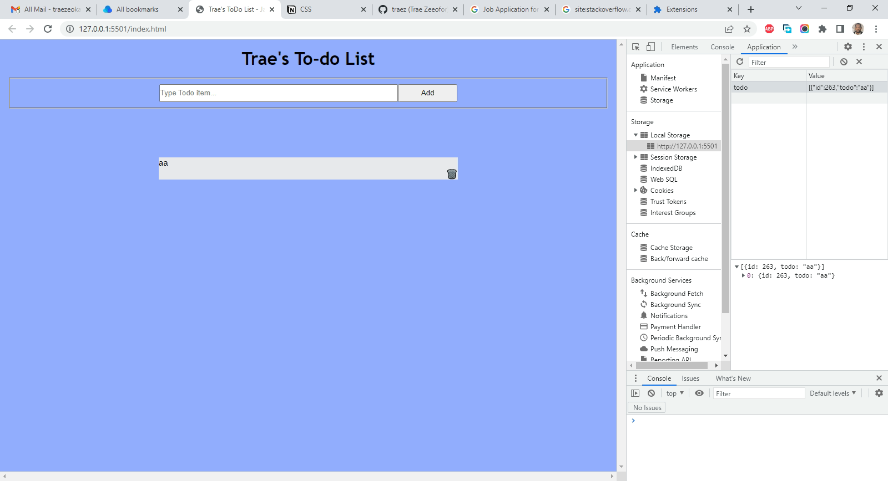

# Section.io - Todo List JavaScript Project on JS Beginners

This is a solution to the [Todo List JavaScript Project on JS Beginners.](https://jsbeginners.com/todo-list-javascript-project-v1/). I am trying to improve my coding skills by building realistic projects. 

## Table of contents

- [Overview](#overview)
  - [The challenge](#the-challenge)
  - [Screenshot](#screenshot)
  - [Links](#links)
- [My process](#my-process)
  - [Built with](#built-with)
  - [What I learned](#what-i-learned)
  - [Continued development](#continued-development)
  - [Useful resources](#useful-resources)
- [Author](#author)
- [Acknowledgments](#acknowledgments)

## Overview

### The challenge

Users should be able to:

- Users should be able to add new items as well as delete items.
- Data should persist since this app uses local storage.  

### Screenshot

### Links

- Solution URL: [https://github.com/traez/goated-oop-project-with-javascript](https://github.com/traez/goated-oop-project-with-javascript)
- Live Site URL: [https://traez.github.io/goated-oop-project-with-javascript/](https://traez.github.io/goated-oop-project-with-javascript/)

## My process

### Built with

- Semantic HTML5 markup
- CSS custom properties
- Flexbox
- CSS Grid
- Mobile-first workflow

### What I learned

1) Confusion gone. I've now permanently left novice stage in using Objects (OOP), Classes and Local storage. 

### Continued development

More practice in same [Objects (OOP), Classes and Local storage].    

### Useful resources

Stackoverflow, MDN Web Docs, w3schools, YouTube, Google 

## Author

- Website - [Trae Zeeofor](https://github.com/traez)  
- Twitter - [@trae_z](https://twitter.com/trae_z) 

## Acknowledgments

End of the year party people world over.
